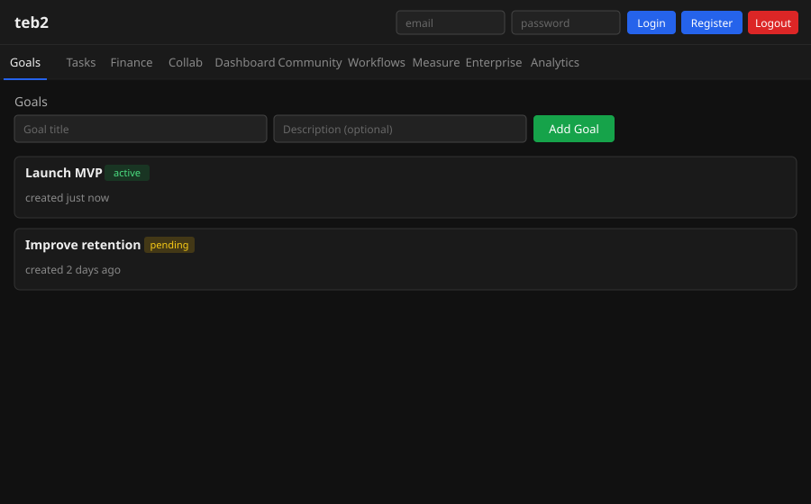

# teb2

teb2: C99 goal-to-execution bridge for AI agent orchestration, financial pipelines, and browser automation.

**Architecture contracts, strictly enforced by CI:**
- 166-line cap per `.c` / `.h` file.
- 2-in / 1-out function contracts.
- Flat includes — no transitive dependency graph.
- Zero runtime tests — the compiler + `-Werror -fanalyzer` are the test suite.

## The loop

    Goal → Clarify → Decompose → Execute → Measure → Learn
              ↑                                         │
              └───────────── learnings ─────────────────┘

`Learn` writes durable insights that later `Clarify` / `Decompose` /
`outreach.nudge` calls consume as context. Every agent operates via a
versioned named prompt under `prompts/`, not a string literal buried in
C source. See [`docs/AGENTS.md`](docs/AGENTS.md) and
[`docs/PROMPTS.md`](docs/PROMPTS.md) for the agent / prompt reference,
and [`docs/FOLLOWUPS.md`](docs/FOLLOWUPS.md) for work still outstanding.

## File inventory

The "23-file minimal kernel" framing from the initial seed is dead —
the product grew. Live counts (verified in CI by `evals/run.sh`):

    find core agents api db auth exec -name '*.[ch]' | wc -l   # 150 files
    find prompts -name '*.md'                        | wc -l   # 99 prompts
    find ui      -name '*.js'                        | wc -l   # 10 scripts

Every one still obeys the 166-line cap.

## Screenshot



---

## Getting Started

### Docker (recommended)

Docker is the fastest way to get teb2 running — no compiler or native libraries required on your machine.

**1. Prerequisites**

Install [Docker ≥ 20.10](https://docs.docker.com/get-docker/) and [Docker Compose v2](https://docs.docker.com/compose/install/) (included with Docker Desktop on macOS/Windows; on Linux run `apt-get install docker-compose-plugin`).

Verify:
```bash
docker --version        # Docker version 20.10+
docker compose version  # Docker Compose version v2+
```

**2. Clone the repository**

```bash
git clone https://github.com/aiparallel0/teb2.git
cd teb2
```

**3. Copy the environment file**

```bash
cp .env.example .env
```

**4. Edit `.env`**

Open `.env` in any text editor. It contains three variables:

```
DB_PATH=teb2.db          # path (inside the container) where SQLite stores data
SECRET=change_me_in_production   # secret key used for JWT signing — CHANGE THIS
PORT=8080                # internal port the C binary listens on
```

> ⚠️ **Always replace `SECRET` with a long, random string before exposing the app to any network.**  
> Generate one with: `openssl rand -hex 32`

**5. Build and start**

```bash
docker compose up --build -d
```

This builds the two-stage Docker image (compiles the C binary in `gcc:latest`, then copies it into `debian:bookworm-slim`) and starts two containers:
- **app** — the teb2 C binary, listening on port 8080 (internal only)
- **nginx** — reverse proxy, reachable on port 80 (and 443 if TLS is configured)

**6. Wait for the app to become healthy**

```bash
docker compose ps
```

Wait until the `app` service shows `(healthy)` in the `STATUS` column. nginx will not start until the healthcheck at `GET /healthz` passes (up to ~35 seconds on first boot).

**7. Open the app in your browser**

Navigate to **http://localhost** (port 80, served by nginx).

**8. Register an account**

In the top-right header you will see **email** and **password** fields followed by **Login**, **Register**, and **Logout** buttons. Fill in an email and password, then click **Register** to create your first account.

**9. Stopping and cleaning up**

Stop containers (data is preserved in the `teb2-data` Docker volume):
```bash
docker compose down
```

Stop containers **and** delete all stored data:
```bash
docker compose down -v
```

---

### Build from source

Use this path when you want to hack on the C code or run teb2 without Docker.

**1. Prerequisites**

- Linux or macOS
- `gcc` ≥ 9
- `make`
- `libsqlite3-dev` and `libcrypt-dev` (Debian/Ubuntu)

**2. Clone the repository**

```bash
git clone https://github.com/aiparallel0/teb2.git
cd teb2
```

**3. Install build dependencies**

On Debian / Ubuntu:
```bash
sudo apt-get update
sudo apt-get install -y gcc make libsqlite3-dev
```

On macOS (with Homebrew):
```bash
brew install sqlite
```
`libcrypt` is part of glibc on Linux; on macOS the standard `<crypt.h>` is available in Xcode Command Line Tools.

**4. Copy and load the environment file**

```bash
cp .env.example .env
```

Edit `.env` to set a real `SECRET` value (see step 4 in the Docker guide above), then export the variables into your shell:

```bash
export $(cat .env | xargs)
```

**5. Compile**

```bash
make
```

The Makefile runs `gcc -std=c99` and links `-lsqlite3 -lcrypt`. The resulting binary is `./teb2` in the project root.

**6. Run**

```bash
./teb2
```

The server starts and serves the UI from the `ui/` directory. By default it listens on the port specified in `PORT` (default `8080`).

**7. Open the app in your browser**

Navigate to **http://localhost:8080**

**8. (Optional) Serve via nginx**

To put nginx in front of the native binary, copy `nginx/nginx.conf` into your nginx configuration directory and adjust the `proxy_pass` upstream to point to `http://127.0.0.1:8080`. Reload nginx: `sudo nginx -s reload`.

---

### Tips

| Scenario | Command |
|---|---|
| Stream container logs | `docker compose logs -f app` |
| Reset the database (Docker) | `docker compose down -v && docker compose up -d` |
| Reset the database (native) | Stop the app, delete `teb2.db`, restart |
| Change the external port | Set `LISTEN_PORT=8081` in `.env` before `docker compose up` |
| Generate a secure `SECRET` | `openssl rand -hex 32` |

> **Note on `SECRET`:** This value is used to sign and verify JWT tokens. Use a long, random string (≥ 32 bytes) in any non-development environment.

---

## Project layout

```
api/        HTTP route handlers
agents/     AI agent modules (coordinator, clarify, finance, …)
auth/       Authentication & RBAC (JWT, bcrypt, roles)
core/       Config, rate limit, shared types, llm, prompts, sanitize
core/pd/    Auto-generated C arrays compiled from prompts/*.md
db/         SQLite schema initialization & per-entity queries
exec/       Browser automation, SMTP, vault, SSE helpers
prompts/    Versioned Markdown prompt sources
docs/       Architecture + follow-up docs
evals/      Smoke eval harness + mock LLM
nginx/      Reverse-proxy configuration
ui/         Frontend — HTML + CSS + JavaScript (no build step)
```

Regenerate prompt C arrays with `make prompts` after editing any
`prompts/*.md`. Run the eval smoke harness with `bash evals/run.sh`.
